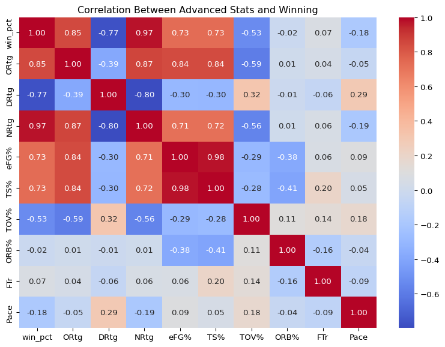
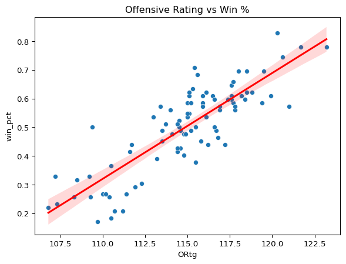
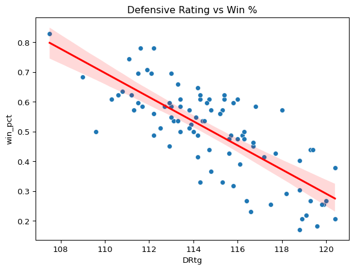
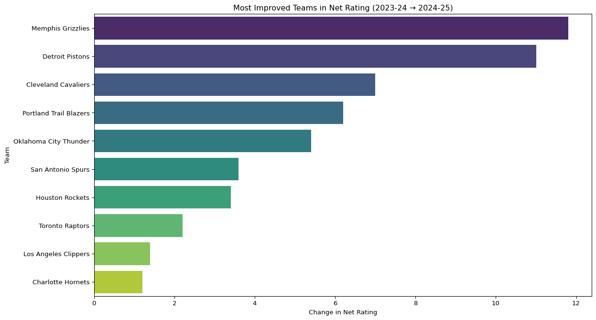

# Exploring NBA Data


## Introduction

This code looks into NBA team statistics for the 2022-23, 2023-24, and
2024-25 seasons. The statistics include basic box score stats and
advanced statistics all taken from
<a href="https://www.sports-reference.com/">. In this README, I
demonstrate the cleaning steps using code chunks. The complete data
loading and merging code is included in my project Python file (Final
Project.py).

## Loading Data and Models

This chunk of code loads imports pandas and the NBA basic and advanced
statistics datasets for the 2022–23, 2023–24, and 2024–25 NBA seasons.
It also assigns them to variable names.

``` python
import pandas as pd

basic_2425 = pd.read_csv("C:/Users/jackm/OneDrive/Documents/Data Wrangling/NBA Basic 24-25.csv")
adv_2425 = pd.read_csv("C:/Users/jackm/OneDrive/Documents/Data Wrangling/NBA ADV 24-25.csv", header=1)
basic_2324 = pd.read_csv("C:/Users/jackm/OneDrive/Documents/Data Wrangling/NBA 2023-24 Basic.csv")
adv_2324 = pd.read_csv("C:/Users/jackm/OneDrive/Documents/Data Wrangling/NBA 2023-24 ADV.csv", header=1)
basic_2223 = pd.read_csv("C:/Users/jackm/OneDrive/Documents/Data Wrangling/NBA 2022-23 Basic.csv")
adv_2223 = pd.read_csv("C:/Users/jackm/OneDrive/Documents/Data Wrangling/NBA 2022-23 ADV.csv", header=1)
```

### Cleaning the Data

In this code, I added a season column for each dataset to help
distinguish the different season for each team. After that, I combined
all basic and advanced stats together. After getting that, I merged both
the advanced stats and basic stats on team name and season into one big
dataset called “nba_all.” I then cleaned columns I didn’t need such as
“Rk_x”, “Unnamed” and “Rk_y.” Finally, I took out the League average
column and took out the \* at the end of team names which means the team
made the playoffs.

``` python
basic_2425["season"] = "2024-25"
adv_2425["season"]   = "2024-25"

basic_2324["season"] = "2023-24"
adv_2324["season"]   = "2023-24"

basic_2223["season"] = "2022-23"
adv_2223["season"]   = "2022-23"

basic_all = pd.concat([basic_2425, basic_2324, basic_2223], ignore_index=True)
adv_all   = pd.concat([adv_2425, adv_2324, adv_2223], ignore_index=True)

nba_all = pd.merge(basic_all, adv_all, on=["Team", "season"], how = 'left')
cols_to_drop = ["Rk_x", "Rk_y"]
cols_to_drop += [c for c in nba_all.columns if c.startswith("Unnamed:")]
nba_all = nba_all.drop(columns=cols_to_drop, errors='ignore')

nba_all["Team"] = nba_all["Team"].str.replace("*", "", regex=False).str.strip()
nba_all = nba_all[nba_all["Team"] != "League Average"]

nba_all = nba_all.reset_index(drop=True)
nba_all
```

<div>
<style scoped>
    .dataframe tbody tr th:only-of-type {
        vertical-align: middle;
    }
&#10;    .dataframe tbody tr th {
        vertical-align: top;
    }
&#10;    .dataframe thead th {
        text-align: right;
    }
</style>

|  | Team | G | MP | FG | FGA | FG% | 3P | 3PA | 3P% | 2P | ... | TOV% | ORB% | FT/FGA | eFG%.1 | TOV%.1 | DRB% | FT/FGA.1 | Arena | Attend. | Attend./G |
|----|----|----|----|----|----|----|----|----|----|----|----|----|----|----|----|----|----|----|----|----|----|
| 0 | Cleveland Cavaliers | 82 | 19755 | 3652 | 7444 | 0.491 | 1303 | 3401 | 0.383 | 2349 | ... | 11.6 | 25.9 | 0.187 | 0.528 | 12.6 | 74.8 | 0.181 | Rocket Arena | 796,712 | 19,432 |
| 1 | Memphis Grizzlies | 82 | 19705 | 3670 | 7654 | 0.479 | 1141 | 3106 | 0.367 | 2529 | ... | 13.1 | 28.7 | 0.196 | 0.533 | 12.9 | 74.9 | 0.206 | FedEx Forum | 683,067 | 16,660 |
| 2 | Denver Nuggets | 82 | 19855 | 3724 | 7360 | 0.506 | 984 | 2619 | 0.376 | 2740 | ... | 12.5 | 26.7 | 0.200 | 0.542 | 11.3 | 74.6 | 0.173 | Ball Arena | 811,211 | 19,786 |
| 3 | Oklahoma City Thunder | 82 | 19705 | 3660 | 7600 | 0.482 | 1192 | 3184 | 0.374 | 2468 | ... | 10.3 | 24.2 | 0.180 | 0.513 | 14.9 | 74.6 | 0.211 | Paycom Center | 754,832 | 17,973 |
| 4 | Atlanta Hawks | 82 | 19780 | 3556 | 7528 | 0.472 | 1107 | 3089 | 0.358 | 2449 | ... | 13.2 | 26.3 | 0.196 | 0.560 | 13.8 | 76.0 | 0.202 | State Farm Arena | 657,613 | 16,440 |
| ... | ... | ... | ... | ... | ... | ... | ... | ... | ... | ... | ... | ... | ... | ... | ... | ... | ... | ... | ... | ... | ... |
| 85 | Orlando Magic | 82 | 19780 | 3323 | 7074 | 0.470 | 883 | 2551 | 0.346 | 2440 | ... | 13.4 | 23.8 | 0.227 | 0.550 | 13.1 | 77.7 | 0.211 | Amway Center | 728,405 | 17,766 |
| 86 | Charlotte Hornets | 82 | 19830 | 3385 | 7413 | 0.457 | 881 | 2669 | 0.330 | 2504 | ... | 12.3 | 23.8 | 0.195 | 0.544 | 12.5 | 75.5 | 0.211 | Spectrum Center | 702,052 | 17,123 |
| 87 | Houston Rockets | 82 | 19755 | 3329 | 7287 | 0.457 | 856 | 2619 | 0.327 | 2473 | ... | 14.0 | 30.2 | 0.215 | 0.564 | 11.8 | 75.8 | 0.218 | Toyota Center | 668,865 | 16,314 |
| 88 | Detroit Pistons | 82 | 19805 | 3244 | 7140 | 0.454 | 934 | 2659 | 0.351 | 2310 | ... | 13.3 | 24.9 | 0.227 | 0.557 | 11.9 | 74.0 | 0.231 | Little Caesars Arena | 759,715 | 18,596 |
| 89 | Miami Heat | 82 | 19805 | 3215 | 6991 | 0.460 | 980 | 2852 | 0.344 | 2235 | ... | 12.4 | 22.8 | 0.224 | 0.561 | 14.5 | 77.7 | 0.198 | Kaseya Center | 807,190 | 19,688 |

<p>90 rows × 51 columns</p>
</div>

## Question 1: Which Advanced Stats Explain Winning?

``` python
# Create win percentage
nba_all["win_pct"] = nba_all["W"] / nba_all["G"]

stats_to_test = [
    "ORtg", "DRtg", "NRtg", "eFG%", "TS%",
    "TOV%", "ORB%", "FTr", "Pace"
]

corr_df = nba_all[["win_pct"] + stats_to_test].corr()
```

``` python
import seaborn as sns
import matplotlib.pyplot as plt

plt.figure(figsize=(10, 7))
sns.heatmap(corr_df, annot=True, cmap="coolwarm", fmt=".2f")
plt.title("Correlation Between Advanced Stats and Winning")
plt.show()
```



To answer this question, I decided to create a heatmap that shows the
correlation between advanced statistics and win percentage. Based on the
results of the heatmap, it is shown that the most important advanced
statistics for winning games is eFG% and TS%. This suggest that if you
want to win more games you have to find efficient players who shoot the
ball well.

## Question 2: What is More Important Offense or Defense?

``` python
import statsmodels.formula.api as smf

model = smf.ols("win_pct ~ ORtg + DRtg", data=nba_all).fit()
print(model.summary())

sns.scatterplot(data=nba_all, x="ORtg", y="win_pct")
sns.regplot(data=nba_all, x="ORtg", y="win_pct", scatter=False, color="red")
plt.title("Offensive Rating vs Win %")
plt.show()

sns.scatterplot(data=nba_all, x="DRtg", y="win_pct")
sns.regplot(data=nba_all, x="DRtg", y="win_pct", scatter=False, color="red")
plt.title("Defensive Rating vs Win %")
plt.show()
```

                                OLS Regression Results                            
    ==============================================================================
    Dep. Variable:                win_pct   R-squared:                       0.950
    Model:                            OLS   Adj. R-squared:                  0.949
    Method:                 Least Squares   F-statistic:                     821.6
    Date:                Wed, 10 Dec 2025   Prob (F-statistic):           3.24e-57
    Time:                        14:11:11   Log-Likelihood:                 178.64
    No. Observations:                  90   AIC:                            -351.3
    Df Residuals:                      87   BIC:                            -343.8
    Df Model:                           2                                         
    Covariance Type:            nonrobust                                         
    ==============================================================================
                     coef    std err          t      P>|t|      [0.025      0.975]
    ------------------------------------------------------------------------------
    Intercept      0.4146      0.240      1.727      0.088      -0.063       0.892
    ORtg           0.0281      0.001     24.792      0.000       0.026       0.030
    DRtg          -0.0274      0.001    -19.985      0.000      -0.030      -0.025
    ==============================================================================
    Omnibus:                        2.637   Durbin-Watson:                   2.215
    Prob(Omnibus):                  0.268   Jarque-Bera (JB):                1.967
    Skew:                           0.273   Prob(JB):                        0.374
    Kurtosis:                       3.476   Cond. No.                     1.09e+04
    ==============================================================================

    Notes:
    [1] Standard Errors assume that the covariance matrix of the errors is correctly specified.
    [2] The condition number is large, 1.09e+04. This might indicate that there are
    strong multicollinearity or other numerical problems.





For this question, I decided to create a regression and scatterplots to
show the effect of offensive and defensive rating on win percentage. The
results show that both offense and defense are important to winning. The
The *R*-squared for this model is high at 0.95. Offensive Rating had a
coefficient of 0.0281, while defensive ratings coefficient was -0.0274.
Defensive coefficient was negative, but this makes sense as you want a
lower rating as you are giving up less points per 100 possessions.
People view the NBA as an offensive game, so this can explain the
results shown.

## Question 3: Which Teams Improved the Most from 2023-24 to 2024-25?

``` python
nba_all["season_num"] = nba_all["season"].astype(str).str[:4].astype(int)

nba_all = nba_all.sort_values(["Team", "season_num"])

nba_all["NRtg_change"] = nba_all.groupby("Team")["NRtg"].diff()

improvement = nba_all[nba_all["season"] == "2024-25"][["Team", "NRtg_change"]].dropna()
improvement = improvement.sort_values("NRtg_change", ascending=False)

improvement.head(10).to_markdown()

top_changes = improvement.head(10)

plt.figure(figsize=(14,8))
sns.barplot(data=top_changes, x="NRtg_change", y="Team", palette="viridis")
plt.title("Most Improved Teams in Net Rating (2023-24 → 2024-25)")
plt.xlabel("Change in Net Rating")
plt.ylabel("Team")
plt.show()
```



To answer this, I decided to create a barplot that shows the change in
net rating for teams from the 2023-24 and 2024-25 season. According to
the bar plot, the teams that improved the most in net rating were the
Memphis Grizlies, Detroit Pistons, and Cleveland Cavaliers. This
improvement is tied to changes in the teams roster such as adding star
players or making trades to improve the roster around already present
star players.
